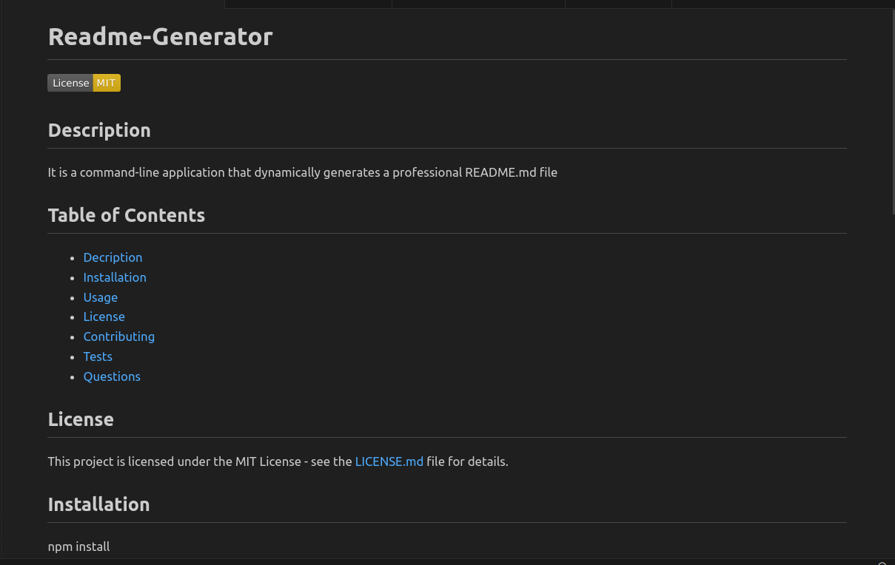
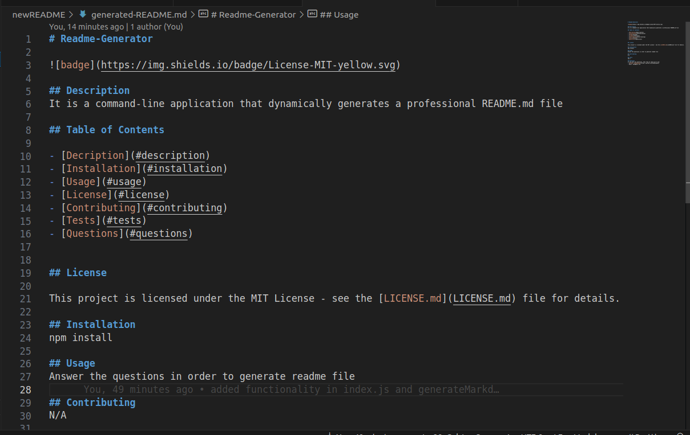

# Readme-Generator

## Overview

It is a command-line application that dynamically generates a professional README.md file.

## Website visuals

The following image shows the web application's appearance and functionality:

## Technologies

- Markdown
- javascript
- node

## Website

https://github.com/ahmadsaqib1/readme-generator.git

## Contributions

Made by Ahmad Saqib
